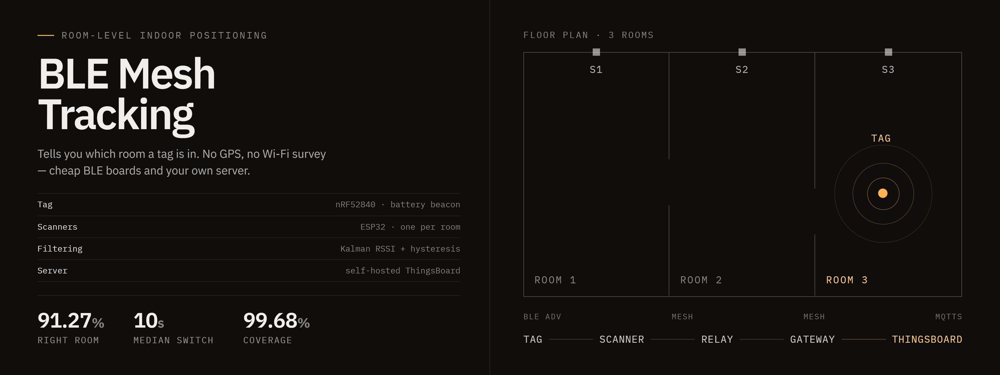
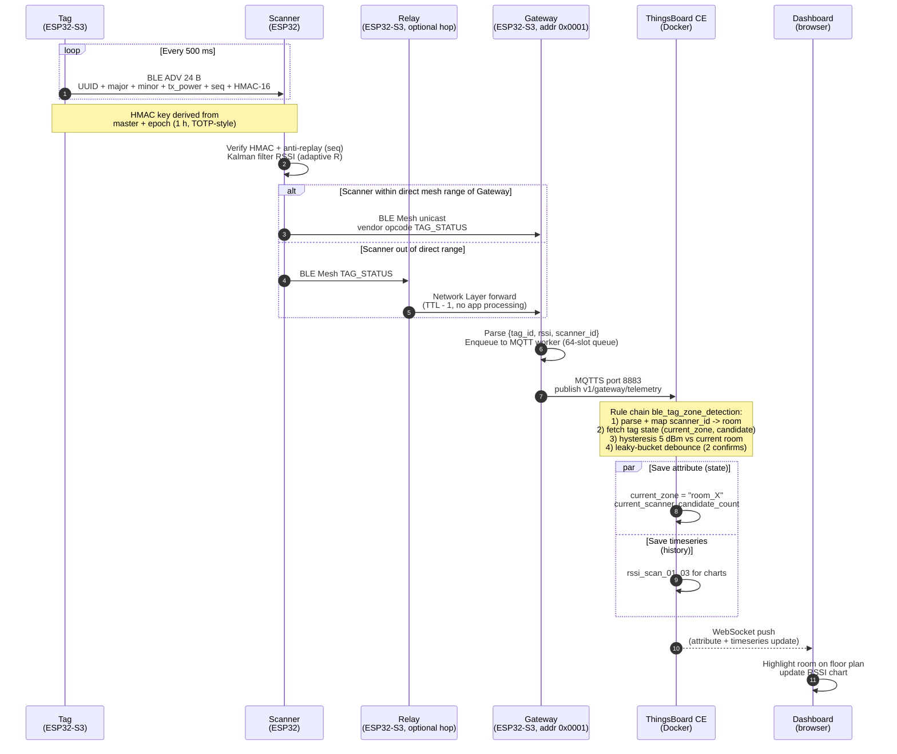

# BLE Mesh Tracking

Room-level indoor tracking on ESP32 / ESP32-S3 with BLE Mesh and a self-hosted ThingsBoard CE.

Tags send BLE beacons. Scanners read signal strength. A relay forwards mesh packets. The gateway pushes raw data to ThingsBoard over MQTTS. A ThingsBoard rule chain turns RSSI into a room name.

New to the project? Start with [docs/00-quickstart.md](docs/00-quickstart.md) (one-page). For the ThingsBoard side in depth — device profiles, rule chain, dashboard aliases, `ZONE_MAP`, MQTT topics, TLS trust, verification, common problems — see [docs/04-thingsboard.md](docs/04-thingsboard.md).

## Documentation

Read in order — each doc assumes the previous ones:

| # | File | Description |
|---|---|---|
| 00 | [docs/00-quickstart.md](docs/00-quickstart.md) | Clone, install ESP-IDF, run Docker, build and flash, verify. Linux and Windows. |
| 01 | [docs/01-architecture.md](docs/01-architecture.md) | System layout and how data moves between nodes. |
| 02 | [docs/02-ble-mesh.md](docs/02-ble-mesh.md) | BLE Mesh parts used in this project. |
| 03 | [docs/03-algorithms.md](docs/03-algorithms.md) | Kalman filter, HMAC, hysteresis, OTA compare, watchdog. |
| 04 | [docs/04-thingsboard.md](docs/04-thingsboard.md) | Whole ThingsBoard stack: install, profiles, rule chain, dashboard, MQTT topics, TLS trust, HTTPS OTA server, troubleshooting. |
| 05 | [docs/05-operation.md](docs/05-operation.md) | Runtime behavior, UART commands, factory reset, source layout, checklists (pre-commit, pre-flash, pre-release, deployment). |
| 06 | [docs/06-testing.md](docs/06-testing.md) | 16 tests: bring-up, walking, self-heal, watchdog, OTA end-to-end + fault injection, regression baseline. |
| 07 | [docs/07-secure-boot.md](docs/07-secure-boot.md) | Secure Boot V2 and Flash Encryption: concept, fleet signing key, first-flash caveats. |

### Other references

- [CHANGELOG.md](CHANGELOG.md) — release history (Keep-a-Changelog + SemVer).
- [apps/Beacon_ProMicroNrf52840/README.md](apps/Beacon_ProMicroNrf52840/README.md) and [apps/Beacon_XiaoNrf52840/README.md](apps/Beacon_XiaoNrf52840/README.md) — optional coin-cell tag variants on nRF52840 (build via Zephyr / west).

## Hardware

| Node | Board | What it does |
|---|---|---|
| Tag | ESP32-S3 | Sends a BLE beacon every 500 ms. |
| Scanner x3 | ESP32 | Reads tag RSSI and sends `TAG_STATUS` over mesh. |
| Relay | ESP32-S3 | Forwards mesh packets between far scanners and the gateway. |
| Gateway | ESP32-S3 | Provisions mesh, forwards data to ThingsBoard, runs OTA. |

## Firmware layout

Four apps under `apps/`. Each is a standard ESP-IDF project with modules under `components/bmt_*/`.

| App | Modules | What it does |
|---|---|---|
| **gateway** | 14 (config, types, mesh, node_table, mac_cache, scan_list, mqtt, thingsboard, ota, wifi, watchdog, uart, zone, factory_reset) | Provisions the mesh, bridges data to ThingsBoard over MQTTS, runs OTA, resets the mesh if it goes silent. |
| **scanner** | 10 (config, types, auth, scan_core, tag_table, mesh, scan, ota, uart, factory_reset) | Reads tag BLE beacons, verifies HMAC, sends `TAG_STATUS` over mesh. |
| **relay** | 6 (config, types, mesh, ota, uart, factory_reset) | Forwards mesh packets at the Network Layer between far scanners and the gateway. Handles `RESET_CMD` and `OTA_TRIGGER`. |
| **tag** | 4 (config, auth, beacon, uart) | Sends a 24-byte BLE beacon every 500 ms with a sequence number and HMAC-16. |

Shared code (relay and scanner OTA) lives at repo root under `components/bmt_ota/`.

## Data flow

## License

Apache License 2.0. See [LICENSE](LICENSE) for the full text and [NOTICE](NOTICE) for third-party attributions.

You are free to use, modify, and redistribute this project for any purpose, including commercial, as long as you keep the copyright and license notices. The Apache-2.0 patent grant applies.

## Contact

<strong>Cao Trong Phuoc</strong> - Software Engineer - Embedded Systems

