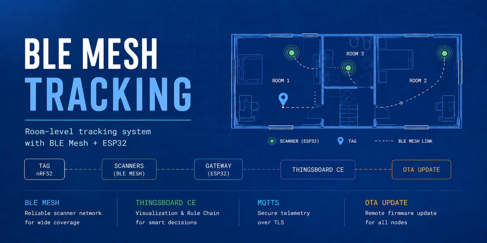
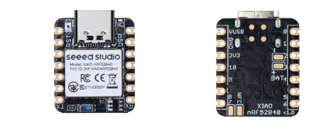
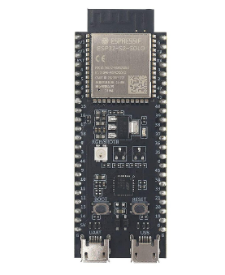
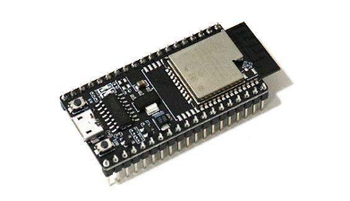
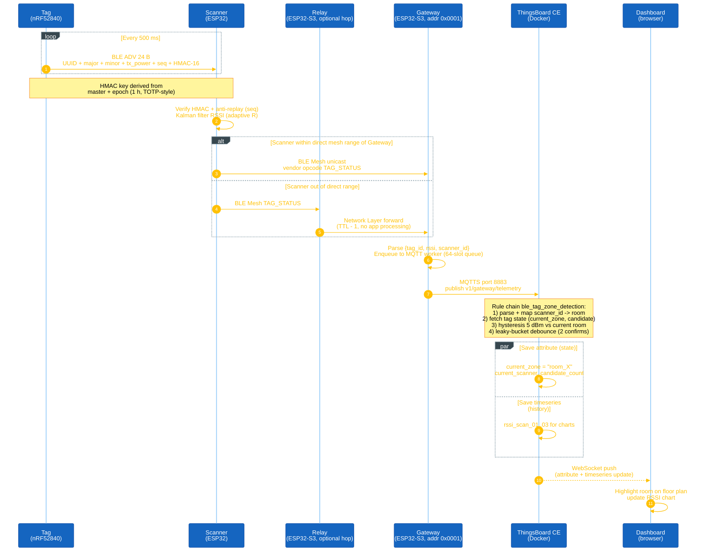

<div align="center">


</div>

<p align="center">
  
  
  
  
</p>

# BLE Mesh Tracking - Room-level Indoor Tracking on ESP32

<center>
</center>

<hr>

## Demo

<div align="center">
  <em>Demo video coming soon.</em>
</div>

## Documentation

| File | Description |
| --- | --- |
| [README.md](README.md) | Project overview and reading map. |
| [docs/00-quickstart.md](docs/00-quickstart.md) | Clone, install, build, flash, verify. Linux + Windows. |
| [docs/01-architecture.md](docs/01-architecture.md) | System layout and data flow. |
| [docs/02-ble-mesh.md](docs/02-ble-mesh.md) | BLE Mesh parts used. |
| [docs/03-algorithms.md](docs/03-algorithms.md) | Kalman, HMAC, hysteresis, OTA compare, watchdog. |
| [docs/04-thingsboard.md](docs/04-thingsboard.md) | ThingsBoard: install, profiles, rule chain, dashboard, MQTT, TLS, OTA server. |
| [docs/05-operation.md](docs/05-operation.md) | UART commands, factory reset, checklists. |
| [docs/06-testing.md](docs/06-testing.md) | 16 test scenarios. |
| [docs/07-secure-boot.md](docs/07-secure-boot.md) | Secure Boot V2, Flash Encryption, key regen. |
| [apps/Beacon_XiaoNrf52840/README.md](apps/Beacon_XiaoNrf52840/README.md) | Tag firmware (XIAO nRF52840). |
| [apps/Beacon_ProMicroNrf52840/README.md](apps/Beacon_ProMicroNrf52840/README.md) | Tag firmware (ProMicro nRF52840). |

## Introduction

Room-level indoor tracking on ESP32 / ESP32-S3 with BLE Mesh and a self-hosted ThingsBoard CE. Tags beacon, scanners read RSSI, a relay forwards mesh packets, the gateway pushes to ThingsBoard over MQTTS, and a rule chain turns RSSI into a room name.

## Getting Started

Pick the trail that fits your goal:

- **Run it end to end:** [docs/00-quickstart.md](docs/00-quickstart.md).
- **Understand the design:** [docs/01-architecture.md](docs/01-architecture.md) -> [docs/02-ble-mesh.md](docs/02-ble-mesh.md) -> [docs/03-algorithms.md](docs/03-algorithms.md).
- **Server side:** [docs/04-thingsboard.md](docs/04-thingsboard.md).
- **Operate and test:** [docs/05-operation.md](docs/05-operation.md), [docs/06-testing.md](docs/06-testing.md).
- **Harden for production:** [docs/07-secure-boot.md](docs/07-secure-boot.md).
- **Coin-cell nRF52840 tag:** [XIAO](apps/Beacon_XiaoNrf52840/README.md) or [ProMicro](apps/Beacon_ProMicroNrf52840/README.md).

> Before the first `idf.py build`, generate the two signing keys per [keys/README.md](keys/README.md) - the build fails without them.

### I. Hardware

<table align="center">
  <tr>
    <td align="center"></td>
    <td align="center"></td>
    <td align="center"></td>
  </tr>
  <tr>
    <td align="center"><strong>Tag</strong><br/>Seeed XIAO nRF52840<br/><em>(coin-cell)</em></td>
    <td align="center"><strong>Gateway + Relay</strong><br/>ESP32-S3-DevKitC-1</td>
    <td align="center"><strong>Scanner</strong> (x3)<br/>ESP32-DevKitC-V4</td>
  </tr>
</table>
<p align="center"><strong><em>Figure 1:</em></strong> Boards used for each node role</p>

Gateway and Relay share the same ESP32-S3 hardware with different firmware. [apps/tag/](apps/tag/) is an ESP32-S3 reference build kept for bench testing.

### II. Firmware Layout

Four ESP-IDF apps under [apps/](apps/) plus the Zephyr-based nRF52840 Tag. Shared modules under `components/bmt_*/`.

<div align="center">

| App | Framework | Role |
|---|---|---|
| **gateway** | ESP-IDF | Provisions the mesh, bridges to ThingsBoard over MQTTS, runs OTA. |
| **scanner** | ESP-IDF | Reads tag beacons, verifies HMAC, sends `TAG_STATUS` over mesh. |
| **relay** | ESP-IDF | Forwards mesh packets at Network Layer between far scanners and the gateway. |
| **Beacon_XiaoNrf52840** | Zephyr / MCUboot | Primary Tag: 24-byte BLE beacon every 500 ms with HMAC-16. |
| **tag** *(bench)* | ESP-IDF | Same wire protocol as the Zephyr Tag; used for A/B testing. |

</div>

Shared OTA code: [components/bmt_ota/](components/bmt_ota/).

### III. Data Flow



<p align="center"><strong><em>Figure 2:</em></strong> End-to-end data flow</p>

### IV. Runtime and OTA

- **Provisioning:** Gateway in AUTO mode, one node at a time, Static OOB auth. See [docs/02-ble-mesh.md](docs/02-ble-mesh.md).
- **Self-healing:** Watchdog broadcasts `RESET_CMD` if the mesh goes silent for 30 s. See [docs/05-operation.md#self-healing](docs/05-operation.md#self-healing).
- **OTA over mesh:** Gateway beacon triggers per-node `.bin` download from the nginx HTTPS server. See [docs/06-testing.md#ota](docs/06-testing.md#ota).
- **Security:** Secure Boot V2, Flash Encryption, HMAC-16 on beacons, TLS + CN pinning on MQTTS. See [docs/07-secure-boot.md](docs/07-secure-boot.md).

## Contact & Support

<p style="font-size: 20px;"><strong>Cao Trong Phuoc</strong> - Software Engineer - Embedded Systems</p>

``` Note
Thank you for visiting this repository.
If you have any questions, suggestions, or feedback about this project or firmware development, feel free to contact me directly.
```

<a href="https://github.com/caotrongphuoc">
  
</a>

<a href="https://www.linkedin.com/in/cao-trong-phuoc/">
  
</a>
