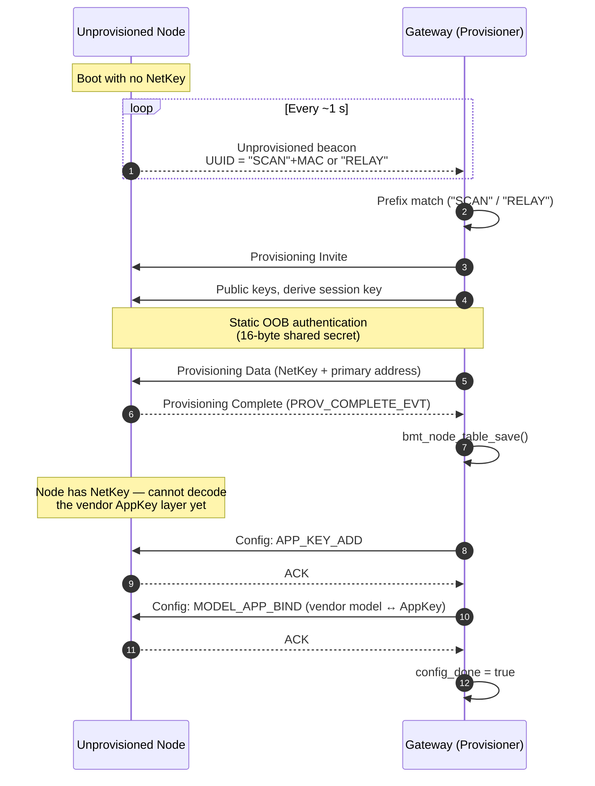

# BLE Mesh in this project

Only the parts we use. Full spec: Bluetooth Mesh Profile 1.0.1.

## Why mesh instead of raw BLE

Raw BLE is point-to-point. A far scanner would need direct radio contact with the gateway; walls break that. Mesh adds a Network Layer that forwards packets across nodes, so a scanner can reach the gateway through a relay.

## Roles

- **Provisioner** — the gateway. Finds unprovisioned nodes, gives them keys, assigns their address, binds their models to an AppKey. Only one in the network.
- **Node** — everyone else. Holds keys, sends and forwards messages.

We do not use Friend / Low Power nodes.

## Keys

- **NetKey** — encrypts the Network Layer. Every node must have the same NetKey or packets get silently dropped.
- **AppKey** — encrypts the Access Layer. The gateway binds it to our vendor model. Any node that sends or receives vendor messages needs this AppKey too.

Both are random per network. The gateway generates them once (`bmt_mesh_generate_keys_if_needed()`), the stack saves them to NVS (`CONFIG_BLE_MESH_SETTINGS=y`), and they survive reboots.

Nodes receive NetKey during provisioning. They receive AppKey via a config message (`APP_KEY_ADD`) sent right after.

## Addresses

Gateway = `0x0001`. Nodes start at `0x0002`. `0xFFFF` = all-nodes broadcast, used for `RESET_CMD`.

## Provisioning

Unprovisioned nodes advertise with a UUID that carries a label:

- Scanner: ASCII `SCAN` + chip Bluetooth MAC.
- Relay: ASCII `RELAY`.

Gateway sees the beacon, checks the prefix, runs the standard flow:

1. `Provisioning Invite`.
2. Public key exchange, derive session key.
3. Static OOB authentication (see below).
4. `Provisioning Data` (NetKey + primary address).
5. Node emits `PROV_COMPLETE_EVT`.

Gateway saves the new address in `bmt_node_table_save()`.

## Static OOB

A 16-byte secret both sides know before they meet:

```c
static const uint8_t BMT_MESH_STATIC_OOB_VAL[16] = { 0x8E, 0x2F, ... };
```

Provisioner passes it via `esp_ble_mesh_provisioner_set_static_oob_value()`. Node passes it as `static_val` in `esp_ble_mesh_prov_t`. Both derive a check number from the secret during authentication; a rogue device without the same 16 bytes fails and provisioning aborts.

For real deployment, change these bytes.

## Vendor model

We define one vendor model (ID `0x0000` under Espressif CID `0x02E5`) carrying our own opcodes:

| Opcode | Payload | Direction | Meaning |
|---|---|---|---|
| `TAG_STATUS` | `bmt_tag_report_t` | scanner -> gateway | RSSI report for one tag. |
| `RESET_CMD` | 1 byte | gateway -> all | Wipe and reboot. |
| `OTA_TRIGGER` | 1 byte target | gateway -> node | Start WiFi OTA. |
| `OTA_RESULT` | `bmt_ota_result_t` | node -> gateway | OTA success or failure. |
| `OTA_KEY_PUSH` | 16 bytes | gateway -> scanner | New HMAC beacon key. |

Declared in each app's `bmt_types.h` and must match byte-for-byte across gateway/scanner/relay.

## Config Client and Config Server

To hand over AppKeys and bind models, the mesh spec uses two extra models:

- **Config Server** on every node — processes `APP_KEY_ADD`, `MODEL_APP_BIND`, `DEFAULT_TTL_GET`.
- **Config Client** on the provisioner — sends those requests.

Our gateway's `bmt_mesh.c` sends two per node during configuration: `APP_KEY_ADD` then `MODEL_APP_BIND`. Only after both ACKs come back does the gateway set `config_done = true`.

## Full flow: unprovisioned beacon to `config_done`



Only nodes with `config_done = true` can send or receive vendor opcodes (`TAG_STATUS`, `RESET_CMD`, `OTA_TRIGGER`, …). See [operation.md](05-operation.md) for what happens if a node reboots mid-config, and for the self-heal path when the gateway restarts.

## Publishing and TTL

```c
s_vnd_models[0].pub->publish_addr = dst;      // unicast or 0xFFFF
s_vnd_models[0].pub->app_idx      = s_app_key_idx;
s_vnd_models[0].pub->ttl          = 7;
esp_ble_mesh_model_publish(&s_vnd_models[0], opcode, len, data, ROLE_PROVISIONER);
```

TTL 7 allows up to 7 hops. Our mesh is much smaller so this is generous.

## Relay feature

`.relay = ESP_BLE_MESH_RELAY_ENABLED` in the config server lets a node forward at the Network Layer without needing the AppKey. The dedicated relay is the main forwarder; scanners also relay to add redundancy.

## Persistence

`CONFIG_BLE_MESH_SETTINGS=y` saves NetKey, AppKey, devkey, sequence numbers, and node list to NVS. Without it every reboot generates a fresh NetKey and the mesh dies. Sequence numbers matter too — nodes reject packets with a seq lower than expected as replays.

Related docs: [operation.md](05-operation.md) for runtime, [algorithms.md](03-algorithms.md) for the math on top.
