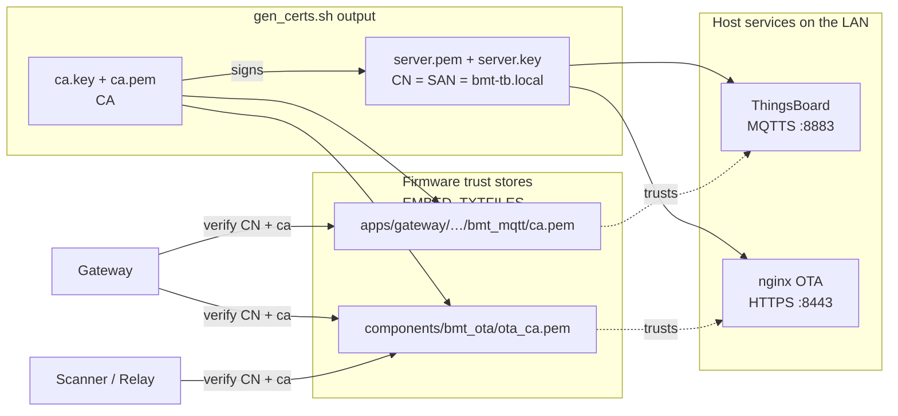

# ThingsBoard

Only the gateway talks to ThingsBoard. It publishes telemetry for
itself and every sub-device (scan nodes, relay, tags) via the
ThingsBoard Gateway API, and subscribes to the RPC topic for OTA
commands. This is the single reference for the whole TB stack —
setup, MQTT topics, TLS trust, HTTPS OTA, troubleshooting.

## What is in `thingsboard/`

- `docker-compose.yml` — three containers: ThingsBoard CE 3.7,
  PostgreSQL, and an nginx OTA fileserver on port 8443.
- `rulechain/`:
  - `ble_tag_zone_detection.json` — zone algorithm (hysteresis +
    leaky-bucket debounce). Default chain for the `ble_tag` profile.
  - `ble_mesh_node.json` — persists `ota_last_result` and
    `ota_last_time` attributes per node. Default chain for the
    `ble_mesh_node` profile.
- `dashboard/indoor_tracking.json` — dashboard, ready to import.
  6 widgets, includes an OTA status panel.
- `tls/` — CA + server certs (CN and SAN both = `bmt-tb.local`;
  firmware verifies CN, so switching machines or IPs does not require
  re-issuing certs). Repo ships no key material; run `tls/gen_certs.sh`
  once — see below.
- `ota-nginx.conf` — nginx config for the OTA fileserver.

## Setup

Do the steps in order — later steps depend on earlier ones.

### 1. Install Docker

Docker Desktop on Windows / macOS. Native `docker` +
`docker-compose-plugin` on Linux.

### 2. Generate the TLS bundle (once)

The repo ships no key material. On a fresh clone, generate a dev CA +
server cert before starting the stack. The script also copies the new
`ca.pem` into both firmware `EMBED_TXTFILES` paths so the next
firmware build trusts this server:

```
cd thingsboard
bash tls/gen_certs.sh
```

Requires `openssl` (Git Bash on Windows already has it). Re-run any
time certs expire or if you change the hostname inside the script.

### 3. Start ThingsBoard

```
docker compose up -d
```

First run takes 1–2 minutes for image download and database init.
Check status:

```
docker compose ps          # 3 running: thingsboard, tb-postgres, bmt-ota-server
docker compose logs -f tb  # look for "Started ThingsboardServerApplication"
```

The third container `bmt-ota-server` (nginx on **HTTPS port 8443**)
serves firmware `.bin` files out of the repo's `firmware/` directory.
Build a new firmware, the `.bin` lands there, mesh nodes can download
it.

### 4. Log in

Open `http://localhost:8080`, log in with `tenant@thingsboard.org` /
`tenant`, then change the password (top-right → Profile).

### 5. Create two device profiles

Menu Device profiles → `+`. Names must match **character-for-character**:

| Name | For |
|---|---|
| `ble_tag` | Tracked tags |
| `ble_mesh_node` | Scanner and Relay (online / offline state) |

You do not create a device per tag or node — the gateway self-declares
them over MQTT Gateway API (`v1/gateway/connect`) with a
`"type": "ble_tag"` or `"ble_mesh_node"` field defined in
`apps/gateway/components/bmt_config/bmt_config.h`
(`BMT_PROFILE_TAG` / `BMT_PROFILE_NODE`). ThingsBoard looks up the
profile **by name** — a one-character mismatch drops the device into
the `default` profile and the zone rule chain never runs for it.

### 6. Create the gateway device and copy the token

Menu Devices → `+ Add device`. Name it `bmt_gateway`, tick
**Is gateway**. In the Credentials tab, copy the Access Token.

Paste it into `apps/gateway/components/bmt_config/bmt_config.h`:

```c
#define BMT_TB_GATEWAY_TOKEN "<paste token here>"
```

Also update `BMT_TB_IP` in the same file to the LAN IP of the machine
running Docker.

### 7. Import the rule chains

Menu Rule chains → `+ Import`:

- `thingsboard/rulechain/ble_tag_zone_detection.json` — **set as
  default** for the `ble_tag` profile (Profiles → Device profiles →
  `ble_tag` → ✏ → Rule chain → Save).
- `thingsboard/rulechain/ble_mesh_node.json` — set as default for the
  `ble_mesh_node` profile.

Setting the default is easy to forget. Importing a rule chain just
places it in the library; **which chain a device's telemetry flows
into is decided by the device's profile**. Skip this step and tag
telemetry only passes through the Root chain (raw storage) — the
zone attribute is never computed.

### 8. Update `ZONE_MAP` with real scanner MACs

Open `ble_tag_zone_detection` → double-click the **Apply hysteresis**
node → find the top of the script:

```js
var ZONE_MAP = {
    "9a01c6842178": "room_1",
    "12a60986e694": "room_2",
    "86eab91ad6b8": "room_3"
};
```

Replace the keys with your scanner MACs (lowercase, no `:`) and set
the values to room labels. To read a MAC, power the scanner, open the
serial port at 115200, press `1` — the `MAC` line is right there.
Save the script (✓), then **Save rule chain** (top-right).

Editing `ZONE_MAP` in the browser instead of firmware is the main
benefit of this architecture: moving a scanner to a different room
is a one-line edit, no reflash.

### 9. Import the dashboard

Menu Dashboards → `+ Import dashboard` → pick
`thingsboard/dashboard/indoor_tracking.json`.

Map the entity aliases:

- `Selected Tag` — `Entity from dashboard state`; populated when a
  row in the tracked-tags table is clicked.
- `All Tags` — filter by `Device profile = ble_tag`, resolving
  multiple entities for the summary table.
- `All Mesh Devices` — include the `default`, `ble_tag`, and
  `ble_mesh_node` profiles (used by the all-devices table).
- `Mesh Nodes` — include the `ble_mesh_node` and `default` profiles
  so the node-status table also includes the gateway.

In view mode, click a row in **Tracked Tags** to load that tag into
the floor plan, current-zone card, RSSI charts, and diagnostic
widgets.

### 10. Rebuild and flash the gateway

After step 6, rebuild `apps/gateway` and flash. The gateway connects
over MQTTS on port 8883 and auto-registers sub-devices under the
right profile.

## Verification

Power all boards (order does not matter), then check the chain — if
anything is off, stop and fix it there:

1. **Gateway serial** at 115200 prints `WiFi connected` →
   `MQTTS -> mqtts://<ip>:8883 (verify CN=bmt-tb.local)` →
   `MQTT connected to ThingsBoard`.
2. Gateway auto-provisions: `Provision complete addr=0x000X` for each
   node. Press `1` — every node shows `ACTIVE` / `ONLINE` and a
   `Node table saved to NVS (N nodes)` line follows.
3. Regular `[VND] src=... MAC=... tag=0x0001 rssi=...` lines flow →
   mesh + tag OK.
4. **ThingsBoard → Entities → Devices**: `bmt_tag_0x0001` and
   `bmt_node_<12-hex-MAC>` appear automatically as the gateway
   self-declares them.
5. Open the tag device → **Attributes** → `current_zone` updates as
   the tag moves between rooms.
6. Open the *Indoor Tracking* dashboard → the position updates live
   and the OTA Status table shows each mesh node's online state and
   last OTA result.

**Self-heal check.** Unplug the gateway for 10 s → plug it back in →
the log should print `Node table loaded (N nodes)` →
`NVS nodes detected — watching 30s` → `Mesh OK`, and data resumes on
its own with no board touched.

## MQTT topics

All topics are relative to the connected client (the gateway) and use
the [ThingsBoard Gateway API](https://thingsboard.io/docs/reference/gateway-mqtt-api/).

| Direction | Topic | Payload example | Purpose |
|---|---|---|---|
| pub | `v1/devices/me/telemetry` | `{"status":"ONLINE"}` | gateway self telemetry |
| pub | `v1/devices/me/attributes` | `{"role":"gateway"}` | gateway self attributes |
| pub | `v1/gateway/connect` | `{"device":"bmt_node_765ca3077000","type":"ble_mesh_node"}` | register sub-device |
| pub | `v1/gateway/disconnect` | `{"device":"bmt_node_765ca3077000"}` | remove sub-device |
| pub | `v1/gateway/attributes` | `{"bmt_node_765ca3077000":{"role":"scan"}}` | sub-device attributes |
| pub | `v1/gateway/telemetry` | `{"bmt_tag_0x0001":[{"scanner_id":"765ca3077000","rssi":-58}]}` | tag / node telemetry |
| sub | `v1/devices/me/rpc/request/+` | `{"method":"ota_scanner"}` | OTA and other server-side calls |

Topic constants and JSON building live in
[`apps/gateway/components/bmt_thingsboard/bmt_thingsboard.c`](../apps/gateway/components/bmt_thingsboard/bmt_thingsboard.c);
the client init and event handler in
[`apps/gateway/components/bmt_mqtt/bmt_mqtt.c`](../apps/gateway/components/bmt_mqtt/bmt_mqtt.c).

The gateway authenticates with an access token (not username /
password). Get it from the TB UI on the `bmt_gateway` device page
(Credentials tab) and paste it into `BMT_TB_GATEWAY_TOKEN`. Tokens
rotate with the device: if the gateway device is deleted and
re-created, get a new token.

## TLS trust chain

One dev CA signs one server cert. Both host services (MQTTS on 8883
and nginx OTA on 8443) present that same server cert; every firmware
trust store is a copy of the same `ca.pem`.



`gen_certs.sh` refreshes both firmware copies of `ca.pem` as part of
the same run, so the two verification paths never drift apart.

### Cert files under `thingsboard/tls/`

| File | Role |
|---|---|
| `ca.key` | CA private key. Never leaves the machine. |
| `ca.pem` | CA cert. Firmware trusts this to verify the server. |
| `server.key` | Server private key. |
| `server.pem` | Server cert signed by CA. Presented in TLS handshake. |
| `server.csr` | Intermediate signing request. Regenerated each run. |
| `server_ext.cnf` | OpenSSL extension file with SAN. |
| `gen_certs.sh` | Regenerates everything. |

Two firmware locations embed the CA via `EMBED_TXTFILES`, both
copies of the same `thingsboard/tls/ca.pem`:

- `apps/gateway/components/bmt_mqtt/ca.pem` — for MQTTS. Symbols
  `bmt_ca_pem_start/end`.
- `components/bmt_ota/ota_ca.pem` — for the shared OTA client used by
  gateway / scanner / relay. Symbols `bmt_ota_ca_pem_start/end`.

`gen_certs.sh` writes both.

### CN verification (not full SAN)

`bmt_mqtt.c` sets the client to verify the server's Common Name
against `BMT_TB_CN = "bmt-tb.local"`. Not SAN. That means:

- Server cert must have CN = `bmt-tb.local`.
- IP of the server does not matter — you can change it without
  regenerating certs.

Why CN and not SAN: the gateway has no DNS resolution, only IP. CN
mode fits that constraint.

## HTTPS OTA server (nginx, port 8443)

`docker compose up -d` also starts an `nginx` container serving the
repo's `firmware/` directory over HTTPS. Config:
[`thingsboard/ota-nginx.conf`](../thingsboard/ota-nginx.conf) — nginx
listens on 443 inside the container, mapped to host port 8443. Both
the cert / key pair and CA come from `thingsboard/tls/`.

Expected files:

- `https://<host-ip>:8443/Gateway.bin`
- `https://<host-ip>:8443/Scanner.bin`
- `https://<host-ip>:8443/Relay.bin`

The URLs in `bmt_config.h` (`BMT_OTA_*_URL`) must match.

Why 8443 and not 443 or 8080: 8080 is the ThingsBoard Web UI (the OTA
HTTP server used to sit there and clashed). 8443 is the conventional
"HTTPS alternate" port, avoids the privileged sub-1024 range so the
container needs no extra capabilities, and does not collide with TB
UI (8080) or MQTTS (8883). The port is not special to the firmware —
just the second half of `BMT_OTA_SERVER_BASE`; change it in
`docker-compose.yml` and change it in `bmt_config.h` too.

The `.bin` still has protection independent of transport (SHA256 in
the app descriptor, version-compare downgrade guard, HMAC beacon
gating the trigger), but HTTPS closes the LAN eavesdrop path
regardless. HTTPS reuses the existing MQTT TLS cert / key pair, so
there is no extra cert to manage.

`bmt_ota.c` (gateway self-update, and shared `components/bmt_ota` used
by relay / scanner) verifies the server cert against the embedded
`ota_ca.pem` and checks the CN against `BMT_OTA_SERVER_CN`, same
pattern as the MQTT client above.

### Firewall

Port 8443 must be reachable from the LAN.

- Linux: `sudo ufw allow 8443/tcp`.
- Windows: allow the Docker / nginx process through Defender when it
  prompts.

Test from another machine:

```
curl -sk -o /dev/null -w "%{http_code}\n" https://<host-ip>:8443/Gateway.bin
```

Should print `200`. `-k` skips CA verification for this manual check;
the firmware itself verifies via the embedded `ota_ca.pem`.

## MQTT reconnect and queue

The MQTT client is configured with `reconnect_timeout_ms = 5000`. On
disconnect it retries every 5 seconds forever.

During disconnects:

- The gateway continues to receive mesh messages.
- The MQTT worker still removes tag reports from its 64-slot queue.
- `bmt_tb_pub_tag_report()` updates the gateway's local tag state,
  then returns without publishing.
- Removed reports are not retained or replayed after reconnect. This
  is intentional for live RSSI data, which becomes stale quickly.
- State transitions are handled separately: if a tag becomes
  `out_of_range` while MQTT is disconnected, the gateway marks that
  attribute update as pending and replays it after reconnect. A
  fresh tag report cancels the pending update before it can become
  stale.

The 64-slot queue decouples the BLE Mesh callback from the MQTT
worker during normal operation; it is not an offline buffer. If
incoming reports outpace the worker and fill the queue, new reports
are dropped and counted. The drop counter is visible on the gateway
with UART command `3`.

## Regenerate certs

Re-run `bash thingsboard/tls/gen_certs.sh` (same command as step 2).
It refreshes `ca.*` / `server.*` in `thingsboard/tls/` and copies the
new `ca.pem` into both firmware `EMBED_TXTFILES` paths. Then rebuild
the gateway (and any node whose OTA CA must trust the new server) so
`EMBED_TXTFILES` bundles the fresh CA into the image, and restart the
Docker stack so the containers reload the server cert:

```
cd thingsboard
docker compose restart
```

## Debug a failing TLS handshake

Watch the gateway serial log at boot for MQTTS, and at OTA time on
gateway / scanner / relay for the OTA client:

- `MQTT connected to ThingsBoard` — MQTTS good.
- `[OTA] esp_https_ota_begin FAILED` — OTA handshake or HTTP error.
  Look one line above for the mbedtls reason.
- `mbedtls: X509 - Certificate verification failed` — embedded CA does
  not match server's cert. Common cause: regenerated certs on the
  server but forgot to rebuild firmware, so an old CA is still
  embedded.
- `mbedtls: X509 - The CRT/CRL/CSR verification failed` — CN
  mismatch. Check `BMT_TB_CN` / `BMT_OTA_SERVER_CN` against the actual
  server cert CN.

Rule out the server side from another machine:

```
openssl s_client -connect <host-ip>:8443 -showcerts     # OTA nginx
openssl s_client -connect <host-ip>:8883 -showcerts     # ThingsBoard MQTTS
```

If both return the correct CN and issuer, the problem is on the
firmware side (wrong embedded `ca.pem` or wrong CN define).

## Common problems on a new deployment

| Symptom | Cause | Fix |
|---|---|---|
| Gateway prints `MQTT disconnected` repeatedly | TB not running, wrong `BMT_TB_IP`, or wrong token | `docker compose ps`, ping the IP, re-check the token |
| Tag ends up in the `default` profile | Profile created after the gateway first connected, or a name typo | Delete that device — the gateway recreates it under the right profile |
| Tag has telemetry but no `current_zone` | Missed the "set default rule chain" part of step 7 | Set it, then wait for the next telemetry packet |
| Zone stuck on one room | `ZONE_MAP` MAC is wrong (case, colons) | Compare with `1` on the scanner serial |
| Node provisions but says `Failed to find Dst` after reboot | Gateway was reflashed without erasing (NVS layout drift) | `idf.py erase-flash flash` on the gateway, then `r` on each node |
| Web UI on 8080 does not come up | TB still booting or Docker not running | `docker compose logs -f tb` to watch progress |

## Optional: carry historical data across hosts

The two JSON exports carry logical config only — not telemetry or
position history. Data lives in the Docker PostgreSQL volume. To
migrate it too:

```bash
# Old host — back up the volume to a tarball:
docker run --rm -v thingsboard_postgres-data:/data -v ${PWD}:/backup alpine tar czf /backup/tb-data.tar.gz -C /data .

# New host — after `docker compose up -d`, stop the stack and restore:
docker compose down
docker run --rm -v thingsboard_postgres-data:/data -v ${PWD}:/backup alpine sh -c "rm -rf /data/* && tar xzf /backup/tb-data.tar.gz -C /data"
docker compose up -d
```

Find the volume name with `docker volume ls`. Rarely needed for a
demo — a new deployment just starts writing fresh data.
