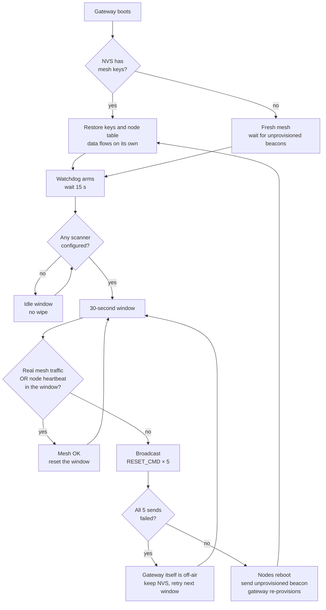

# Runtime operation

How the system behaves once it is up, the UART command reference for
every node, and the checklists that catch mistakes before they cost a
re-flash trip.

## Auto provisioning

The gateway runs in AUTO mode. It finds unprovisioned nodes by their
UUID prefix (`SCAN` or `RELAY`). It provisions each one with Static
OOB authentication. Then it adds the AppKey, binds the vendor model,
and pushes the current HMAC beacon key.

This flow is event-driven and handles one node at a time. Power on
and provision nodes one at a time - wait for a node to reach "fully
configured" before powering the next one. Powering several
unprovisioned nodes together can cause some of them to miss
`APP_KEY_ADD` / `MODEL_APP_BIND` and get stuck without full config.

NetKey and AppKey are random. They live in NVS. Protocol details in
[ble-mesh.md](02-ble-mesh.md).

## Tag data flow

Tags send a 24-byte BLE ADV (Espressif CID `0x02E5`) with a sequence
number and a 16-bit HMAC.

Scanners check the HMAC. They filter RSSI, drop replays, and send
`TAG_STATUS {tag_id, rssi}` over mesh.

The gateway maps the mesh source address to a scanner MAC. It
forwards `{scanner_mac, tag_id, rssi}` to ThingsBoard.

The rule chain picks `current_zone`. The dashboard shows it.

Numbers behind the filters (Kalman, path loss, anti-replay, HMAC-16)
are in [algorithms.md](03-algorithms.md).

## Self-healing

- The gateway loses power? On boot, NVS restores the mesh keys and
  the node table. Data flows again on its own.
- The data watchdog waits 15 seconds after boot, then stays active
  for the lifetime of the gateway. It waits while no scanner is
  configured and checks each 30-second window once a scanner is
  available. If no real mesh traffic or successful node heartbeat
  arrives in a window, it broadcasts `RESET_CMD` five times and
  re-provisions. If all five sends fail, it does not wipe.
- A node reboots and sends an unprovisioned beacon again. The
  gateway drops the old entry and re-provisions it.
- The gateway pings every configured scanner and relay every 20
  seconds. This heartbeat is independent of tag traffic, drives node
  online / offline state, and keeps an idle-but-healthy mesh from
  being mistaken for a dead one. Only ACKs with `error_code == 0`
  count as "mesh alive".
- Manual escape hatch: hold the BOOT button (GPIO0) on any
  provisioned node for 10 seconds - see [Factory reset](#factory-reset-boot-button)
  below.

Watchdog exercise procedure: [testing.md](06-testing.md) test 7.



In parallel, `bmt_mesh_ping` polls every configured scanner and
relay every 20 s. Ping ACKs with `error_code == 0` also count as
"real mesh traffic" in the window above - so an idle-but-healthy
mesh is never mistaken for a dead one.

## OTA and beacon security

- OTA for scanners and relays runs over mesh. Each node downloads
  its `.bin` from the LAN HTTPS server and reports `OTA_RESULT` back.
- The gateway checks its own firmware by SHA256. If it is the same,
  it skips OTA.
- **Two independent HMAC key schedules**:
  - **Tag beacon key** - derived TOTP-style from a shared master key
    plus an epoch counter that ticks every 1 hour. Tag and scanner
    recompute the current epoch key from the same master, so an ADV
    captured in one epoch cannot be replayed in the next. Tag epoch
    is a local counter from `esp_timer_get_time()` (no RTC needed);
    the scanner tracks a `locked_epoch` and tolerates a narrow drift
    window around it.
  - **OTA-beacon key** - plain rotating key. The gateway makes a new
    random 16-byte key every 24 hours, stores it in NVS, and pushes
    it to every scanner over mesh (encrypted by the mesh AppKey).
    Only scanners holding the current key accept an OTA-beacon.
- Fake beacons that do not know the current key fail HMAC and get
  dropped.

HTTPS OTA server and TLS setup:
[thingsboard.md#https-ota-server-nginx-port-8443](04-thingsboard.md#https-ota-server-nginx-port-8443).
Full OTA test procedure: [testing.md#ota](06-testing.md#ota). Key
derivation and rotation math: [algorithms.md](03-algorithms.md).

## ThingsBoard rule chain

The `ble_tag_zone_detection` rule chain runs on every tag telemetry
event:

1. Read the last state from server attributes.
2. Pick the scanner with the strongest RSSI among fresh samples
   (under 10 seconds old).
3. Only switch zone if the new one beats the current one by at least
   5 dBm (hysteresis) and holds for two updates in a row (debounce).
4. Save `current_zone` and `current_rssi`.

To move a scanner to a different room, edit `ZONE_MAP` on the
server. No reflash needed.

Hysteresis and leaky-bucket debounce are explained in
[algorithms.md](03-algorithms.md). MQTT topics and payloads used
by the rule chain: [thingsboard.md#mqtt-topics](04-thingsboard.md#mqtt-topics).

## UART commands

All nodes use 115200 baud.

### Gateway

| Key | Action |
|---|---|
| `1` | Node table. |
| `2` | Tag and zone view. |
| `3` | MQTT and mesh stats. |
| `4` | Show status / help menu (reprints command list). |
| `s` | Scan for unprovisioned nodes (MANUAL mode). |
| `p` | Provision the scanned list. |
| `a` | Switch to AUTO mode. |
| `m` | Switch to MANUAL mode. |
| `u` | Start OTA for scanners and relays. |
| `g` | Start OTA for the gateway itself. |
| `0` | Soft reset. |
| `9` | Full reset (wipe and re-provision). |

### Scanner and Relay

| Key | Action |
|---|---|
| `1` | Status with MAC. |
| `r` | Reset mesh to unprovisioned. |

### Scanner extras

| Key | Action |
|---|---|
| `i` | Change the legacy scanner id. |
| `o` | Manually trigger WiFi OTA (self-update, bypasses the mesh beacon path - useful when the gateway is not available). |

### Tag

| Key | Action |
|---|---|
| `1` | Status: current sequence, last HMAC, advertising state. |

## Factory reset (BOOT button)

Physical recovery on **gateway, relay, and scanner** (not the tag - 
it has no such component). It matters more now that flash is
encrypted: you can no longer pull NVS off the chip externally, so
this button is the sanctioned way to wipe a node in the field.
Implemented in the `bmt_factory_reset` component
(`bmt_factory_reset.c`).

### How to trigger

While the app is running normally (not at power-on), press and
**hold the BOOT button (GPIO0) continuously for 10 seconds**. The
board polls every 100 ms and the hold must be unbroken - releasing
the button resets the counter to zero immediately, so a brief
release means you start over.

Do not confuse BOOT with the EN / RST button. Holding EN / RST just
keeps the chip in reset with no code running; nothing is counted.

### What you see on serial (115200)

At boot, once per run:

```
Factory reset watcher started (hold BOOT for 10 s to trigger)
```

The moment you press BOOT, then a countdown every second:

```
[FACTORY RESET] BOOT button held...
[FACTORY RESET] 9s until NVS is erased...
[FACTORY RESET] 8s until NVS is erased...
...
[FACTORY RESET] 1s until NVS is erased...
```

At 10 s it erases and reboots:

```
[FACTORY RESET] Held 10s -> erasing all NVS...
[FACTORY RESET] Done, rebooting...
```

If the erase itself fails you get `nvs_flash_erase failed: <error>`
instead - rare, usually means flash trouble, not a config issue.

### What it erases and the consequences

It runs `nvs_flash_erase()` - wipes the **entire NVS partition**,
nothing else. Firmware is untouched (the signed, encrypted app stays
exactly as flashed). Gone after a reset:

- **Gateway**: the whole provisioned node table plus the network's
  NetKey / AppKey and the HMAC OTA-beacon key. The gateway comes
  back up as a fresh provisioner and must re-provision every node
  from scratch - plan for a full bring-up, not a quick reboot.
- **Relay / scanner**: its mesh membership (it becomes unprovisioned
  again). Its NetKey / AppKey and stored keys are gone.

### Next steps after a reset

- Reset a **relay or scanner**: on reboot it sends an unprovisioned
  beacon; a running gateway in AUTO mode re-provisions it on its own
  (see [Self-healing](#self-healing) above). Provision one node at a
  time.
- Reset the **gateway**: bring the mesh back up in order - gateway
  first, then relay, then scanners one at a time, tag last - exactly
  like a fresh flash ([quickstart.md](00-quickstart.md#6-run)).

This is distinct from the UART resets above: `9` (gateway) and `r`
(scanner / relay) do a software-triggered mesh reset while connected
to a console; the BOOT-button path needs no console and is the
fallback when a node is deployed with no serial cable attached.

## Source layout

Each app has one `main/main.c` and a set of components under
`components/bmt_*/`. Each component has its own `.c`, `.h`, and
`CMakeLists.txt`.

### `apps/gateway/`

- `main/main.c` - boot order: NVS, node table, mesh keys, HMAC OTA
  key, MQTT worker, WiFi, MQTT, Bluetooth, mesh, UART, ping,
  watchdog, OTA auto-check.
- `bmt_config` - WiFi, ThingsBoard IP, token, CN, OTA URLs, device
  profile names.
- `bmt_types` - opcodes and structs shared with scanner and relay.
- `bmt_mesh` - provisioner, config task, mesh callbacks, key
  management.
- `bmt_node_table` - provisioned nodes (addr, UUID, MAC, type,
  online). Save and load to NVS.
- `bmt_mac_cache` - short-lived UUID to MAC cache during scan.
- `bmt_scan_list` - manual provisioning (UART `s`, `p`, `a`, `m`).
- `bmt_zone` - local zone guess for debug only. The real zone lives
  on ThingsBoard.
- `bmt_wifi` - WiFi STA with auto-reconnect.
- `bmt_mqtt` - MQTT(S) client, tag report queue, RPC routing. Also
  bundles `ca.pem`.
- `bmt_thingsboard` - payload format for the ThingsBoard Gateway API.
- `bmt_ota` - gateway self-OTA, mesh OTA for scanner and relay, HMAC
  OTA beacon, 24 h key rotation.
- `bmt_watchdog` - data watchdog and full-mesh reset.
- `bmt_uart` - UART command menu (see [UART commands](#uart-commands)
  above).
- `bmt_factory_reset` - holds BOOT button (GPIO0) 10s, erases NVS,
  reboots. Does not touch firmware.

### `apps/scanner/`

- `main/main.c` - calls `bmt_scan_core_init()`.
- `bmt_scan_core` - boot order. Keeps a legacy `scanner_id` in NVS.
  The real ID is the chip MAC.
- `bmt_config` - WiFi (only for OTA) and firmware URL.
- `bmt_types` - opcodes and structs.
- `bmt_auth` - HMAC-16 via PSA API. Two keys: one for tag beacons,
  one for the OTA beacon. The gateway can rotate the OTA-beacon key
  over mesh.
- `bmt_scan` - BLE GAP scan and radio time-sharing with mesh.
- `bmt_tag_table` - up to 20 visible tags. Drops replays. Times out
  after 5 seconds.
- `bmt_mesh` - mesh node. UUID contains the chip MAC. Handles
  `RESET_CMD`, `OTA_TRIGGER`, `OTA_KEY_PUSH`.
- `bmt_ota` - WiFi OTA started by a mesh trigger.
- `bmt_uart` - UART commands `r`, `1`, `i`.
- `bmt_factory_reset` - same as gateway.

### `apps/relay/`

- `main/main.c` - inits Bluetooth, mesh, UART.
- `bmt_config` - fixed Relay UUID (`RELAY...02`), WiFi, OTA URL.
- `bmt_types` - opcodes and structs.
- `bmt_mesh` - mesh node with Relay feature on. Forwards at the
  Network Layer. Also binds AppKey to handle `RESET_CMD` and
  `OTA_TRIGGER`.
- `bmt_ota` - same as scanner.
- `bmt_uart` - UART commands `r`, `1`, plus a 30-second health log.
- `bmt_factory_reset` - same as gateway.

### `apps/tag/`

- `main/main.c` - `bmt_auth_init()`, `bmt_beacon_start()`, UART.
- `bmt_config` - UUID, `tag_id`, tag type (`PERSON` or `ASSET`), TX
  power.
- `bmt_auth` - 16-bit HMAC for each ADV.
- `bmt_beacon` - 24-byte ADV (CID `0x02E5`) with UUID, major, minor,
  TX power, sequence, HMAC. Sends every 500 ms.
- `bmt_uart` - status output (sequence, last HMAC, advertising state).

### `thingsboard/`

- `docker-compose.yml` - ThingsBoard CE 3.7 and PostgreSQL. Ports
  8080 (UI) and 8883 (MQTTS). Also runs `ota-fileserver` (`nginx`),
  port 8443, serving `firmware/` over HTTPS - config in
  `ota-nginx.conf`. Certs from `tls/`.
- `rulechain/` - rule chain exports. Main one is
  `ble_tag_zone_detection.json`.
- `dashboard/indoor_tracking.json` - the dashboard.
- `tls/` - dev CA and server certs. `gen_certs.sh` makes new ones.

## Checklists

Short bullet lists to catch mistakes before they cost a re-flash trip.

### Pre-commit code

- [ ] `clang-format --dry-run --Werror apps/*/components/*/*.c apps/*/main/*.c` returns clean.
- [ ] All 4 apps build: `tools/build-all.sh`.
- [ ] `grep -R "TODO\|FIXME\|XXX" apps/` - either finish them or file an issue.
- [ ] No stray `printf` debug lines left in hot paths (mesh callback, radio manager, MQTT worker).
- [ ] Any new `esp_err_t`-returning call is checked, or the return is deliberately ignored with `(void)`.
- [ ] New heap allocations (`malloc`, `calloc`, `xTaskCreate`) have a matching free path or documented lifetime.
- [ ] New static shared state has either a mutex, an atomic, or a comment explaining why it does not need one.
- [ ] Any change to `bmt_types.h` was mirrored across gateway + scanner + relay (same struct layout + opcode number).

### Pre-commit docs

- [ ] No emoji or icon characters. Sanity check: `grep -Pn "[\x{1F300}-\x{1FAFF}]" docs/ README.md` returns nothing.
- [ ] No filler or marketing phrasing (`In this section we will explore how...`, `robust and elegant solution...`). Direct sentences only.
- [ ] Any new algorithm has a code pointer (file + function).
- [ ] Any UART command mentioned exists in the [UART commands](#uart-commands) section above.
- [ ] Any config define mentioned exists in `bmt_config.h` of the app it belongs to.

### Pre-flash config (before shipping to a customer)

- [ ] `BMT_WIFI_SSID` and `BMT_WIFI_PASS` set to real credentials, not placeholders.
- [ ] `BMT_TB_IP` matches the customer's ThingsBoard host IP.
- [ ] `BMT_TB_GATEWAY_TOKEN` matches the token from ThingsBoard UI. Not the demo token.
- [ ] `BMT_OTA_GATEWAY_URL`, `BMT_OTA_SCANNER_URL`, `BMT_OTA_RELAY_URL` all start with `https://` and are reachable on port 8443 from the deployed LAN.
- [ ] `apps/gateway/components/bmt_mqtt/ca.pem` matches `thingsboard/tls/ca.pem` on the server (`diff` returns nothing).
- [ ] `components/bmt_ota/ota_ca.pem` matches `thingsboard/tls/ca.pem` on the server too - same CA, different embed location.
- [ ] `BMT_TB_CN` and `BMT_OTA_SERVER_CN` both match the CN inside the server cert (`openssl x509 -in server.pem -text | grep CN`).
- [ ] `BMT_TAG_MASTER_KEY` regenerated (not the dev default). Same value in tag AND scanner (both derive the epoch key from it - see [algorithms.md](03-algorithms.md#4a-tag-key-totp-style-epoch-derivation)).
- [ ] `BMT_MESH_STATIC_OOB_VAL` regenerated (not the dev default). Same value in gateway AND scanner AND relay.
- [ ] `CONFIG_BLE_MESH_SETTINGS=y` in gateway `sdkconfig`.
- [ ] Firmware `PROJECT_VER` shows the deployment build time. Sanity: it must be later than every previously flashed version.
- [ ] `keys/bmt_fleet_rsa3072.pem` generated yourself and backed up outside the repo before the first `erase-flash`. See [secure-boot.md](07-secure-boot.md) - the eFuse burn on first boot is permanent per board.

### Pre-release

Before tagging a release:

- [ ] All items in Pre-commit code and Pre-commit docs pass.
- [ ] Test 1 (bring-up) from [testing.md](06-testing.md) passes.
- [ ] Test 3 (walking) passes.
- [ ] Test 6 (gateway persistence) passes.
- [ ] [Fast smoke test](06-testing.md#fast-smoke-test) or the full OTA flow (Tests 9-16) in [testing.md](06-testing.md#ota) passes.
- [ ] Tag the commit with the same date the build produces (`YYYYMMDD`).

### Deployment (on-site)

At the customer site, in order:

- [ ] ThingsBoard container running: `docker compose ps` shows `Up`.
- [ ] Certs regenerated for this deployment (see [thingsboard.md#regenerate-certs](04-thingsboard.md#regenerate-certs)).
- [ ] Firmware flashed with real credentials (see Pre-flash above).
- [ ] Gateway UART shows `MQTT connected to ThingsBoard` within 30 seconds of boot.
- [ ] Relay powered on and provisioned (`[RLY_CFG] Relay 0x00xx fully configured`).
- [ ] All scanners provisioned (`[SCN_CFG] Scan node 0x00xx fully configured`).
- [ ] Tag(s) powered on and visible on the dashboard.
- [ ] `ZONE_MAP` in the ThingsBoard rule chain updated with the actual scanner MACs (read them off UART with command `1`).
- [ ] A full walking test in every room shows the correct zone assignment.
- [ ] HTTPS OTA server running for future updates: `cd thingsboard && docker compose up -d ota-fileserver`.

### After a bug is found in production

- [ ] Reproduce locally with the failing tag / scanner / relay layout.
- [ ] Fix the root cause, not the symptom. Adding another `if` to paper over a race is a symptom fix.
- [ ] Add or update a test in [testing.md](06-testing.md) so the same regression is caught next time.
- [ ] OTA the fix to every node in the field. Verify via ThingsBoard `ota_result` attribute.
