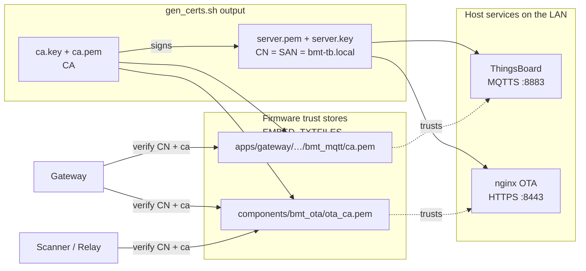

# HTTPS OTA server and TLS

Two protocols outside the mesh: HTTPS for OTA `.bin` transfer, TLS for MQTT.

## HTTPS OTA server

### Serve the built binaries

Every build copies its `.bin` to `firmware/`. An `nginx` container serves that folder over HTTPS as part of the ThingsBoard stack — no manual server to start:

```
cd thingsboard
docker compose up -d ota-fileserver
```

Config: `thingsboard/ota-nginx.conf` (listens on 443 inside the container, mapped to host port 8443), mounted read-only in `thingsboard/docker-compose.yml` alongside `thingsboard/tls/server.pem` / `server.key` — the same cert/key pair MQTTS uses.

Why 8443 and not 443 or 8080: port 8080 is already the ThingsBoard Web UI, and the OTA HTTP server used to sit there and clash with it. 8443 is the conventional "HTTPS alternate" port, it does not collide with the TB UI (8080) or the MQTTS broker (8883), and it avoids the privileged sub-1024 range so the container needs no extra capabilities. The port is not special to the firmware — it is just the second half of `BMT_OTA_SERVER_BASE`, so if you change it in `docker-compose.yml` you change it in `bmt_config.h` too.

Expected files:

- `https://<host-ip>:8443/Gateway.bin`
- `https://<host-ip>:8443/Scanner.bin`
- `https://<host-ip>:8443/Relay.bin`

The URLs in `bmt_config.h` (`BMT_OTA_*_URL`) must match.

### Why HTTPS now (was plain HTTP)

The `.bin` still has its own protection independent of transport: SHA256 in the app descriptor (verified after download), version compare stops downgrade, and the HMAC beacon means an attacker cannot even trigger OTA. A fake `.bin` fails the SHA256 check regardless of transport.

What plain HTTP did not protect: anyone on the same LAN could read the `.bin` in transit. The binary itself does not contain secrets, but it is still an unauthenticated, unencrypted download path sitting next to a server that also holds real credentials — closing it removes one avenue an attacker on the LAN would otherwise have for free. HTTPS reuses the existing MQTT TLS cert/key pair, so there is no extra cert to manage.

`bmt_ota.c` (gateway self-update, and shared `components/bmt_ota` used by relay/scanner) verifies the server's cert against the embedded `ota_ca.pem` (`EMBED_TXTFILES` in each `bmt_ota` component's `CMakeLists.txt`) and checks the CN against `BMT_OTA_SERVER_CN`, same pattern as the MQTT client below.

### Firewall

Port 8443 must be reachable from the LAN.

- Linux: `sudo ufw allow 8443/tcp`.
- Windows: allow the Docker/nginx process through Defender when it prompts.

Test from another machine:

```
curl -sk -o /dev/null -w "%{http_code}\n" https://<host-ip>:8443/Gateway.bin
```

Should print `200`. (`-k` skips CA verification for this manual check; the firmware itself verifies via the embedded `ota_ca.pem`.)

## TLS for MQTT

MQTT to ThingsBoard uses TLS on port 8883. Protects the gateway token and prevents someone on the network from injecting fake telemetry.

### Trust chain

One dev CA signs one server cert. Both host services present that same server cert; every firmware trust store is a copy of the same `ca.pem`.



Every time `gen_certs.sh` runs, both firmware copies of `ca.pem` must be refreshed together (see the [Regenerate certs](#regenerate-certs-production-deploy) section below), otherwise one of the two verification paths breaks.

### Cert layout under `thingsboard/tls/`

| File | Role |
|---|---|
| `ca.key` | CA private key. Never leaves the machine. |
| `ca.pem` | CA cert. Gateway trusts this to verify the server. |
| `server.key` | Server private key. |
| `server.pem` | Server cert signed by CA. Presented in TLS handshake. |
| `server.csr` | Intermediate signing request. Regenerated each run. |
| `server_ext.cnf` | OpenSSL extension file with SAN. |
| `gen_certs.sh` | Regenerates everything. |

Two firmware locations embed the CA cert via `EMBED_TXTFILES` — both are copies of the same `thingsboard/tls/ca.pem`:

- `apps/gateway/components/bmt_mqtt/ca.pem` — for MQTTS to ThingsBoard. Symbols `bmt_ca_pem_start/end`.
- `components/bmt_ota/ota_ca.pem` — for the shared OTA client used by gateway/scanner/relay. Symbols `bmt_ota_ca_pem_start/end`.

Both must be refreshed together after any cert regeneration.

### CN verification (not full SAN)

`bmt_mqtt.c` sets the client to verify the server's Common Name against `BMT_TB_CN = "bmt-tb.local"`. Not SAN. That means:

- Server cert must have CN = `bmt-tb.local`.
- IP of the server does not matter — you can change it without regenerating certs.

Why CN and not SAN: the gateway has no DNS resolution, only IP. CN mode fits that constraint.

### Regenerate certs (production deploy)

```
cd thingsboard/tls
bash gen_certs.sh
cp ca.pem ../../apps/gateway/components/bmt_mqtt/ca.pem
cp ca.pem ../../components/bmt_ota/ota_ca.pem
```

Rebuild and flash gateway, scanner and relay. Then restart the containers (both MQTTS and OTA nginx pick up the new server cert automatically since they mount from `thingsboard/tls/`):

```
cd thingsboard
docker compose restart
```

### Debug a failing handshake

Watch gateway serial log at boot for MQTTS, and at OTA time on gateway/scanner/relay for the OTA client:

- `MQTT connected to ThingsBoard` — MQTTS good.
- `[OTA] esp_https_ota_begin FAILED` — OTA handshake or HTTP error. Look one line above for the mbedtls reason.
- `mbedtls: X509 - Certificate verification failed` — embedded CA does not match server's cert. Common cause: regenerated certs but forgot to update one of the two embedded `ca.pem` files (or forgot to reflash).
- `mbedtls: X509 - The CRT/CRL/CSR verification failed` — CN mismatch. Check `BMT_TB_CN` / `BMT_OTA_SERVER_CN` against actual server cert CN.

Rule out server side from another machine:

```
openssl s_client -connect <host-ip>:8443 -showcerts     # OTA nginx
openssl s_client -connect <host-ip>:8883 -showcerts     # ThingsBoard MQTTS
```

If both return the correct CN and issuer, the problem is on the firmware side (wrong embedded `ca.pem` or wrong CN define).

Related: [04-thingsboard-setup.md](04-thingsboard-setup.md), [05-thingsboard-mqtt.md](05-thingsboard-mqtt.md), [10-testing-ota.md](10-testing-ota.md).
