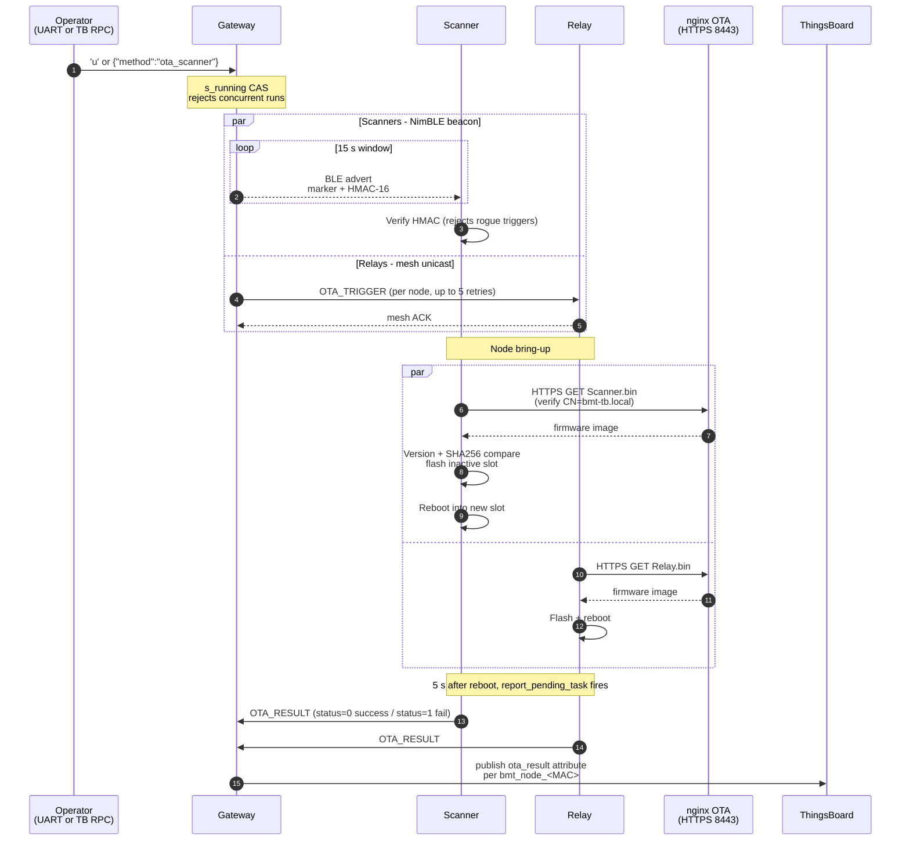

# Testing

Manual verification and OTA fault injection. Tests assume bring-up
(Test 1) works first.

Open serial monitors on every board
(`idf.py -p <port> monitor`, 115200 baud, Ctrl+] to exit) and the
Indoor Tracking dashboard.

## Bring-up and runtime

### Test 1: Bring-up (fresh flash)

Goal: gateway provisions every node, telemetry reaches ThingsBoard.

Provisioning is event-driven and handles one node at a time - power
on nodes one at a time, waiting for each to reach "fully configured"
before powering the next. Powering multiple unprovisioned nodes
together can cause some of them to miss
`APP_KEY_ADD` / `MODEL_APP_BIND` and never finish config.

1. Erase and flash the gateway. Boot log ends with
   `MQTT connected to ThingsBoard`.
2. Power on the relay. Gateway log:
   `Found unprovisioned [RELAY]` → `Provision complete addr=0x00xx`
   → `[CFG] APP_KEY_ADD ACK` → `[CFG] MODEL_APP_BIND ACK` →
   `[RLY_CFG] Relay 0x00xx fully configured`.
3. Same for each scanner (`[SCAN]` prefix), one at a time.
4. Power on the tag. Its log: `ADV OK seq=0` and increments every
   500 ms.
5. Scanner log shows `Tag 0x0001 | RSSI=... | Filt=...`.
6. Gateway log shows `[VND] src=0x00xx MAC=... tag=0x0001 rssi=...`.
7. Press `1` on gateway UART: all nodes `ACTIVE` (scanner) or
   `ONLINE` (relay).
8. Dashboard: `bmt_gateway` online, sub-devices for each node and
   each tag.

If any step fails, fix it before moving on.

### Test 2: End-to-end with one tag

Place tag ~1 m from scanner 1. In sync across logs and dashboard:

- Tag: sequence increments.
- Scanner 1: `Tag 0x0001 | ... RSSI=-4x | Filt=-4x.x` every ~1 s.
- Gateway: `[VND] src=0x0002 ... tag=0x0001 rssi=-4x`.
- Dashboard: tag shows in the room mapped to scanner 1.

If tag increments but scanner does not log Tag, HMAC verify likely
failed. Check `BMT_TAG_MASTER_KEY` matches byte-for-byte in tag AND
scanner `bmt_auth.c`.

### Test 3: Walking test (hysteresis)

Goal: hysteresis and debounce prevent zone flapping.

1. Stand next to scanner 1. Wait for dashboard = room 1.
2. Walk slowly toward scanner 2. RSSIs get close at midpoint.
3. Expect: no per-second zone flip. Switch commits only when new
   zone beats current by ≥ 5 dBm for 2 telemetry frames in a row.

If it flaps: raise `HYSTERESIS_DBM` (see
[algorithms.md](03-algorithms.md)).

### Test 4: Out-of-range

1. Tag reporting normally. Remove its battery.
2. Wait 10 - 15 s.
3. Gateway: `[BMT_TB] Tag 0x0001 OUT OF RANGE`.
4. Dashboard: `current_zone` becomes `out_of_range`.

### Test 5: Node reboot (self-heal)

1. Unplug one scanner for 5 s. Plug back in.
2. Log shows `Already provisioned (restored from NVS)` and traffic
   resumes within seconds.
3. If NVS was cleared (rare brownout), log shows
   `Waiting provision...` and gateway re-provisions it (10 - 20 s).

Same test for the relay.

### Test 6: Gateway reboot (persistence)

1. Yank gateway power for 5 s. Plug back in.
2. Boot log: `Node table loaded (N nodes)`, `NetKey already exists`,
   `AppKey already exists`.
3. Telemetry resumes within 15 - 30 s.
4. Press `1` - every previously provisioned node shows with
   `Config done: YES`.

If log says `NetKey added` (fresh), something wiped NVS. Confirm
`CONFIG_BLE_MESH_SETTINGS=y` in `sdkconfig`.

### Test 7: Relay removed (watchdog triggers reset)

Only fires when telemetry actually stops. Do this only if you have a
scanner needing the relay path.

1. Confirm normal telemetry via the relay.
2. Unplug the relay.
3. Wait 30 - 40 s.
4. Gateway: `No mesh data in 30s -- starting reset cycle`, then 5
   `RESET_CMD` broadcasts, then
   `Gateway FULL RESET -- wiping all mesh state`, then reboot.
5. Plug relay back in. Full re-provision cycle takes about a minute.

### Test 8: Multiple tags

1. Flash 3 - 5 tags with different `BMT_TAG_MINOR`.
2. Every tag shows up in scanner log with different `tag_id`.
3. Every tag on dashboard.
4. Scanner `1` command lists all of them.

Scanner tracks up to `BMT_MAX_TAGS = 20`.

## OTA

Verify each OTA path independently: HTTPS server serves the right
file, version compare prevents downgrade, SHA256 check skips
identical binaries, beacon HMAC key rotation works.

### End-to-end flow



Gateway self-OTA (`g`) is the simpler path: gateway pulls its own
`.bin` from nginx directly and reports the result to ThingsBoard on
`bmt_gateway` before rebooting. No mesh or BLE beacon involved.

### Setup

The nginx OTA fileserver starts automatically as part of the
ThingsBoard stack (`docker compose up -d`). If it is not up already:

```
cd thingsboard && docker compose up -d ota-fileserver
```

Confirm URLs reachable:

```
curl -sk -o /dev/null -w "%{http_code}\n" https://<host-ip>:8443/Scanner.bin
```

Should print `200`. `-k` skips CA verification for this manual check
(the firmware itself verifies against embedded `ota_ca.pem`). Fix
firewall if not `200` (see
[thingsboard.md#firewall](04-thingsboard.md#firewall)).

Open serial monitors on every board.

### Test 9: Gateway self-OTA

Trigger: `g` on gateway UART.

Gateway prints SHA256 of current and server, then one of three
outcomes:

- Same SHA256: `SHA256 match ... skip.` Task exits.
- Different SHA256 but same or older version:
  `Server version is NOT newer ... skip.`
- Newer version: `Server version is NEWER -> flashing`, then
  `OTA SUCCESS -- rebooting`, then reboots.

Confirm new firmware by checking version in the boot banner.

### Test 10: Scanner OTA (broadcast beacon)

Trigger: `u` on gateway UART.

Gateway: `Found 3 SCANNER node(s)` →
`Broadcasting NimBLE beacon (15s)`.

Scanner within seconds:
`BLE beacon from Gateway (HMAC OK) -- triggering WiFi OTA!` →
normal OTA flow.

HMAC mismatch (normal at first boot before key rotation):
`Beacon HMAC mismatch (got 0x???, expect 0x???) -- ignoring`.

### Test 11: Relay OTA (unicast mesh)

After the scanner beacon window ends, gateway moves to relays:

```
[OTA] -- RELAY 1/1: 0x00xx --
[OTA] TRIGGER -> 0x00xx [1/5]: sent
```

Relay: `OTA_TRIGGER from 0x0001 -- starting WiFi OTA` → same flow as
scanner.

Gateway waits 90 s per relay to allow download + reboot.

### Test 12: OTA result reporting

After a node reboots from OTA, its `report_pending_task` fires 5 s
later, reads the pending flag set by `mark_pending()`, sends
`OTA_RESULT`.

Gateway: `Node 0x00xx (...) OTA SUCCESS` or
`OTA FAILED (status=1)`. Also published to ThingsBoard as
`ota_result: SUCCESS` or `FAILED`.

### Test 13: Key rotation

Natural test: wait 24 h. Force test:

1. Temporarily set `BMT_OTA_KEY_ROTATE_INTERVAL_MS` in gateway
   `bmt_ota.c` to 60000. Rebuild, flash.
2. After 60 s, gateway logs
   `OTA-beacon key ROTATED ... pushing to all scanners...`.
3. Each scanner logs
   `OTA_KEY_PUSH received from 0x0001 - rotating beacon key`.
4. Trigger OTA (`u`). Scanners accept the new beacon.
5. Restore 24 h interval and reflash.

### Test 14: Downgrade protection

1. Note current version.
2. Rebuild, copy new `.bin` to `firmware/`. Press `g`, gateway
   flashes.
3. Replace `firmware/Gateway.bin` with an older copy. Press `g`.
4. Expect: `Server version is NOT newer -- skip, no downgrade.`

### Test 15: SHA256 skip

1. Trigger successful OTA, wait for reboot.
2. Immediately trigger the same OTA. Expect: `SHA256 match ... skip.`
3. Gateway does not reboot.

### Test 16: Fault injection

**404 not found.** Delete `firmware/Scanner.bin`. Trigger. Scanner:
`esp_https_ota_begin FAILED`. Sends `OTA_RESULT status=1`. Returns
to BLE scan.

**TLS handshake fail.** Corrupt `components/bmt_ota/ota_ca.pem`
(e.g. replace the last few bytes with garbage), rebuild + flash one
scanner, trigger. Scanner: `esp_https_ota_begin FAILED` preceded by
`mbedtls: X509 - Certificate verification failed`. Confirms the OTA
client actually verifies the server cert against the embedded CA,
not just any HTTPS server on that port. Restore the file afterwards.

**Wrong WiFi password.** Break `BMT_WIFI_PASS` in scanner config and
reflash. Trigger. Scanner: `WiFi connect timeout` after 30 s. Fails,
no reboot.

**Concurrent OTA.** Press `u` while OTA is running. Gateway:
`OTA already running`. Blocked by atomic CAS on `s_running`.

**ThingsBoard RPC.** From ThingsBoard on `bmt_gateway`:

```
{"method": "ota_scanner", "params": {}}
```

Gateway: `[RPC] Received: ...` → `[RPC] OTA Scanner triggered`. Same
for `ota_relay` and `ota_gateway`.

## Fast smoke test

1. `cd thingsboard && docker compose up -d ota-fileserver`.
2. Rebuild gateway (`idf.py build`) - copies new `.bin`.
3. UART `g`. Either "not newer, skip" (just built) or flash + reboot
   (older running). Both mean the path works.

## Regression baseline

Before any release run at minimum: Test 1, Test 3, Test 6, and the
[Fast smoke test](#fast-smoke-test). Covers the most likely
regressions.

## What NOT to test

- Corrupted `.bin` mid-download: ESP-IDF `esp_https_ota_finish()`
  runs a partition verify and rolls back on failure. Library code,
  already tested.
- Rollback on failed flash: bootloader falls back to the previous
  slot. Also library code.
- Manually poking the OTA data partition: do not.
