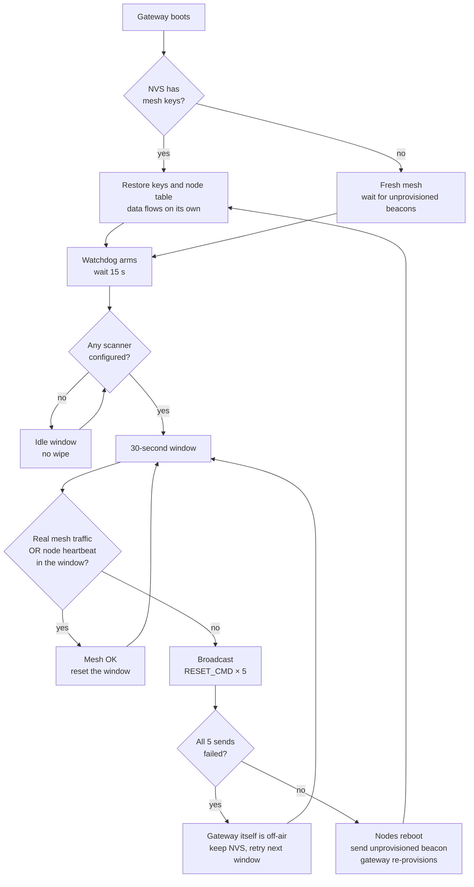

# How it works

## Auto provisioning

The gateway runs in AUTO mode. It finds unprovisioned nodes by their UUID prefix (`SCAN` or `RELAY`). It provisions each one with Static OOB authentication. Then it adds the AppKey, binds the vendor model, and pushes the current HMAC beacon key.

This flow is event-driven and handles one node at a time. Power on and provision nodes one at a time — wait for a node to reach "fully configured" before powering the next one. Powering several unprovisioned nodes together can cause some of them to miss `APP_KEY_ADD`/`MODEL_APP_BIND` and get stuck without full config.

NetKey and AppKey are random. They live in NVS.

Protocol details in [02-ble-mesh.md](02-ble-mesh.md).

## Tag data flow

Tags send a 24-byte BLE ADV (Espressif CID `0x02E5`) with a sequence number and a 16-bit HMAC.

Scanners check the HMAC. They filter RSSI, drop replays, and send `TAG_STATUS {tag_id, rssi}` over mesh.

The gateway maps the mesh source address to a scanner MAC. It forwards `{scanner_mac, tag_id, rssi}` to ThingsBoard.

The rule chain picks `current_zone`. The dashboard shows it.

Numbers behind the filters (Kalman, path loss, anti-replay, HMAC-16) are in [03-algorithms.md](03-algorithms.md).

## Self-healing

- The gateway loses power? On boot, NVS restores the mesh keys and the node table. Data flows again on its own.
- The data watchdog waits 15 seconds after boot, then stays active for the
  lifetime of the gateway. It waits while no scanner is configured and checks
  each 30-second window once a scanner is available. If no real mesh traffic
  or successful node heartbeat arrives in a window, it broadcasts `RESET_CMD`
  five times and re-provisions. If all five sends fail, it does not wipe.
- A node reboots and sends an unprovisioned beacon again. The gateway drops the old entry and re-provisions it.
- The gateway pings every configured scanner and relay every 20 seconds. This
  heartbeat is independent of tag traffic, drives node online/offline state,
  and keeps an idle-but-healthy mesh from being mistaken for a dead one. Only
  ACKs with `error_code == 0` count as "mesh alive".
- Manual escape hatch: hold the BOOT button (GPIO0) on any provisioned node for 10 seconds. `bmt_factory_reset` erases all NVS (mesh keys, node table, auth state) and reboots. The node comes back unprovisioned; the gateway re-provisions on the next beacon. Firmware image is untouched.

Watchdog exercise procedure: [09-testing.md](09-testing.md) test 7.

In parallel, `bmt_mesh_ping` polls every configured scanner and relay every 20 s. Ping ACKs with `error_code == 0` also count as "real mesh traffic" in the window above — so an idle-but-healthy mesh is never mistaken for a dead one.

## OTA and beacon security

- OTA for scanners and relays runs over mesh. Each node downloads its `.bin` from the LAN HTTPS server and reports `OTA_RESULT` back.
- The gateway checks its own firmware by SHA256. If it is the same, it skips OTA.
- **Two independent HMAC key schedules**:
  - **Tag beacon key** — derived TOTP-style from a shared master key plus an epoch counter that ticks every 1 hour. Tag and scanner recompute the current epoch key from the same master, so an ADV captured in one epoch cannot be replayed in the next. Tag epoch is a local counter from `esp_timer_get_time()` (no RTC needed); the scanner tracks a `locked_epoch` and tolerates a narrow drift window around it.
  - **OTA-beacon key** — plain rotating key. The gateway makes a new random 16-byte key every 24 hours, stores it in NVS, and pushes it to every scanner over mesh (encrypted by the mesh AppKey). Only scanners holding the current key accept an OTA-beacon.
- Fake beacons that do not know the current key fail HMAC and get dropped.

HTTPS OTA server and TLS setup: [06-http-tls.md](06-http-tls.md). Full OTA test procedure: [10-testing-ota.md](10-testing-ota.md). Key derivation and rotation math: [03-algorithms.md](03-algorithms.md).

## ThingsBoard rule chain

The `ble_tag_zone_detection` rule chain runs on every tag telemetry event:

1. Read the last state from server attributes.
2. Pick the scanner with the strongest RSSI among fresh samples (under 10 seconds old).
3. Only switch zone if the new one beats the current one by at least 5 dBm (hysteresis) and holds for two updates in a row (debounce).
4. Save `current_zone` and `current_rssi`.

To move a scanner to a different room, edit `ZONE_MAP` on the server. No reflash needed.

Hysteresis and leaky-bucket debounce are explained in [03-algorithms.md](03-algorithms.md). MQTT topics and payloads used by the rule chain: [05-thingsboard-mqtt.md](05-thingsboard-mqtt.md).

## Source layout

Each app has one `main/main.c` and a set of components under `components/bmt_*/`. Each component has its own `.c`, `.h`, and `CMakeLists.txt`.

### `apps/gateway/`

- `main/main.c` — boot order: NVS, node table, mesh keys, HMAC OTA key, MQTT worker, WiFi, MQTT, Bluetooth, mesh, UART, ping, watchdog, OTA auto-check.
- `bmt_config` — WiFi, ThingsBoard IP, token, CN, OTA URLs, device profile names.
- `bmt_types` — opcodes and structs shared with scanner and relay.
- `bmt_mesh` — provisioner, config task, mesh callbacks, key management.
- `bmt_node_table` — provisioned nodes (addr, UUID, MAC, type, online). Save and load to NVS.
- `bmt_mac_cache` — short-lived UUID to MAC cache during scan.
- `bmt_scan_list` — manual provisioning (UART `s`, `p`, `a`, `m`).
- `bmt_zone` — local zone guess for debug only. The real zone lives on ThingsBoard.
- `bmt_wifi` — WiFi STA with auto-reconnect.
- `bmt_mqtt` — MQTT(S) client, tag report queue, RPC routing. Also bundles `ca.pem`.
- `bmt_thingsboard` — payload format for the ThingsBoard Gateway API.
- `bmt_ota` — gateway self-OTA, mesh OTA for scanner and relay, HMAC OTA beacon, 24h key rotation.
- `bmt_watchdog` — data watchdog and full-mesh reset.
- `bmt_uart` — UART command menu (see [08-uart-commands.md](08-uart-commands.md)).
- `bmt_factory_reset` — holds BOOT button (GPIO0) 10s, erases NVS, reboots. Does not touch firmware.

### `apps/scanner/`

- `main/main.c` — calls `bmt_scan_core_init()`.
- `bmt_scan_core` — boot order. Keeps a legacy `scanner_id` in NVS. The real ID is the chip MAC.
- `bmt_config` — WiFi (only for OTA) and firmware URL.
- `bmt_types` — opcodes and structs.
- `bmt_auth` — HMAC-16 via PSA API. Two keys: one for tag beacons, one for the OTA beacon. The gateway can rotate the OTA-beacon key over mesh.
- `bmt_scan` — BLE GAP scan and radio time-sharing with mesh.
- `bmt_tag_table` — up to 20 visible tags. Drops replays. Times out after 5 seconds.
- `bmt_mesh` — mesh node. UUID contains the chip MAC. Handles `RESET_CMD`, `OTA_TRIGGER`, `OTA_KEY_PUSH`.
- `bmt_ota` — WiFi OTA started by a mesh trigger.
- `bmt_uart` — UART commands `r`, `1`, `i`.
- `bmt_factory_reset` — same as gateway.

### `apps/relay/`

- `main/main.c` — inits Bluetooth, mesh, UART.
- `bmt_config` — fixed Relay UUID (`RELAY...02`), WiFi, OTA URL.
- `bmt_types` — opcodes and structs.
- `bmt_mesh` — mesh node with Relay feature on. Forwards at the Network Layer. Also binds AppKey to handle `RESET_CMD` and `OTA_TRIGGER`.
- `bmt_ota` — same as scanner.
- `bmt_uart` — UART commands `r`, `1`, plus a 30-second health log.
- `bmt_factory_reset` — same as gateway.

### `apps/tag/`

- `main/main.c` — `bmt_auth_init()`, `bmt_beacon_start()`, UART.
- `bmt_config` — UUID, `tag_id`, tag type (`PERSON` or `ASSET`), TX power.
- `bmt_auth` — 16-bit HMAC for each ADV.
- `bmt_beacon` — 24-byte ADV (CID `0x02E5`) with UUID, major, minor, TX power, sequence, HMAC. Sends every 500 ms.
- `bmt_uart` — status output (sequence, last HMAC, advertising state).

### `thingsboard/`

- `docker-compose.yml` — ThingsBoard CE 3.7 and PostgreSQL. Ports 8080 (UI) and 8883 (MQTTS). Also runs `ota-fileserver` (`nginx`), port 8443, serving `firmware/` over HTTPS — config in `ota-nginx.conf`. Certs from `tls/`.
- `rulechain/` — rule chain exports. Main one is `ble_tag_zone_detection.json`.
- `dashboard/indoor_tracking.json` — the dashboard.
- `tls/` — dev CA and server certs. `gen_certs.sh` makes new ones.
