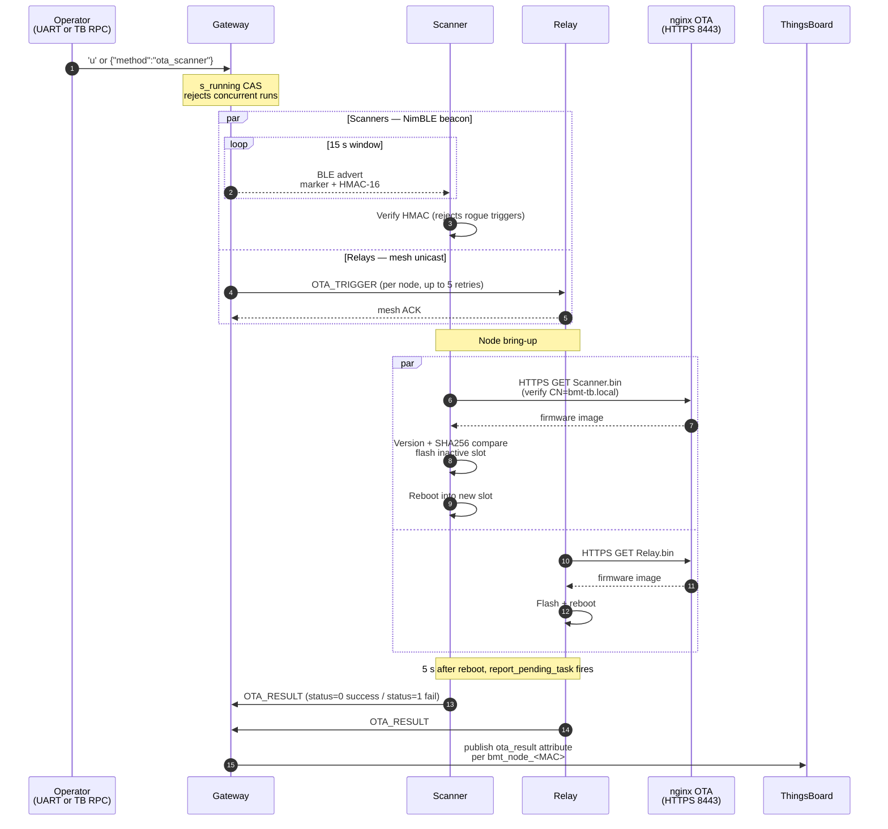

# OTA testing

Verify each OTA path. Assumes bring-up works ([09-testing.md](09-testing.md)).

Four things to verify independently:
1. HTTPS server serves the right file.
2. Version compare prevents downgrade.
3. SHA256 check skips identical binaries.
4. Beacon HMAC key rotation works.

## End-to-end flow



Gateway self-OTA (`g`) is the simpler path: gateway pulls its own `.bin` from nginx directly and reports the result to ThingsBoard on `bmt_gateway` before rebooting. No mesh or BLE beacon involved.

## Setup

The nginx OTA fileserver starts automatically as part of the ThingsBoard stack (`docker compose up -d`). If it is not up already:

```
cd thingsboard && docker compose up -d ota-fileserver
```

Confirm URLs reachable:

```
curl -sk -o /dev/null -w "%{http_code}\n" https://<host-ip>:8443/Scanner.bin
```

Should print `200`. `-k` skips CA verification for this manual check (the firmware itself verifies against embedded `ota_ca.pem`). Fix firewall if not `200` (see [04-thingsboard.md#firewall](04-thingsboard.md#firewall)).

Open serial monitors on every board.

## Test 1: Gateway self-OTA

Trigger: `g` on gateway UART.

Gateway prints SHA256 of current and server, then one of three outcomes:

- Same SHA256: `SHA256 match ... skip.` Task exits.
- Different SHA256 but same or older version: `Server version is NOT newer ... skip.`
- Newer version: `Server version is NEWER -> flashing`, then `OTA SUCCESS -- rebooting`, then reboots.

Confirm new firmware by checking version in the boot banner.

## Test 2: Scanner OTA (broadcast beacon)

Trigger: `u` on gateway UART.

Gateway: `Found 3 SCANNER node(s)` -> `Broadcasting NimBLE beacon (15s)`.

Scanner within seconds: `BLE beacon from Gateway (HMAC OK) -- triggering WiFi OTA!` -> normal OTA flow.

HMAC mismatch (normal at first boot before key rotation): `Beacon HMAC mismatch (got 0x???, expect 0x???) -- ignoring`.

## Test 3: Relay OTA (unicast mesh)

After the scanner beacon window ends, gateway moves to relays:

```
[OTA] -- RELAY 1/1: 0x00xx --
[OTA] TRIGGER -> 0x00xx [1/5]: sent
```

Relay: `OTA_TRIGGER from 0x0001 -- starting WiFi OTA` -> same flow as scanner.

Gateway waits 90 s per relay to allow download + reboot.

## Test 4: OTA result reporting

After a node reboots from OTA, its `report_pending_task` fires 5 s later, reads the pending flag set by `mark_pending()`, sends `OTA_RESULT`.

Gateway: `Node 0x00xx OTA THANH CONG` (success) or `OTA THAT BAI (status=1)`. Also published to ThingsBoard as `ota_result: SUCCESS` or `FAILED`.

## Test 5: Key rotation

Natural test: wait 24 h. Force test:

1. Temporarily set `BMT_OTA_KEY_ROTATE_INTERVAL_MS` in gateway `bmt_ota.c` to 60000. Rebuild, flash.
2. After 60 s, gateway logs `OTA-beacon key ROTATED ... pushing to all scanners...`.
3. Each scanner logs `OTA_KEY_PUSH nhan tu 0x0001 -- rotate key beacon`.
4. Trigger OTA (`u`). Scanners accept the new beacon.
5. Restore 24 h interval and reflash.

## Test 6: Downgrade protection

1. Note current version.
2. Rebuild, copy new `.bin` to `firmware/`. Press `g`, gateway flashes.
3. Replace `firmware/Gateway.bin` with an older copy. Press `g`.
4. Expect: `Server version is NOT newer -- skip, no downgrade.`

## Test 7: SHA256 skip

1. Trigger successful OTA, wait for reboot.
2. Immediately trigger the same OTA. Expect: `SHA256 match ... skip.`
3. Gateway does not reboot.

## Test 8: Fault injection

**404 not found.** Delete `firmware/Scanner.bin`. Trigger. Scanner: `esp_https_ota_begin FAILED`. Sends `OTA_RESULT status=1`. Returns to BLE scan.

**TLS handshake fail.** Corrupt `components/bmt_ota/ota_ca.pem` (e.g. replace the last few bytes with garbage), rebuild + flash one scanner, trigger. Scanner: `esp_https_ota_begin FAILED` preceded by `mbedtls: X509 - Certificate verification failed`. Confirms the OTA client actually verifies the server cert against the embedded CA, not just any HTTPS server on that port. Restore the file afterwards.

**Wrong WiFi password.** Break `BMT_WIFI_PASS` in scanner config and reflash. Trigger. Scanner: `WiFi connect timeout` after 30 s. Fails, no reboot.

**Concurrent OTA.** Press `u` while OTA is running. Gateway: `OTA already running`. Blocked by atomic CAS on `s_running`.

**ThingsBoard RPC.** From ThingsBoard on `bmt_gateway`:

```
{"method": "ota_scanner", "params": {}}
```

Gateway: `[RPC] Received: ...` -> `[RPC] OTA Scanner triggered`. Same for `ota_relay` and `ota_gateway`.

## Fast smoke test

1. `cd thingsboard && docker compose up -d ota-fileserver`.
2. Rebuild gateway (`idf.py build`) — copies new `.bin`.
3. UART `g`. Either "not newer, skip" (just built) or flash + reboot (older running). Both mean the path works.

## What NOT to test

- Corrupted `.bin` mid-download: ESP-IDF `esp_https_ota_finish()` runs a partition verify and rolls back on failure. Library code, already tested.
- Rollback on failed flash: bootloader falls back to the previous slot. Also library code.
- Manually poking the OTA data partition: do not.
